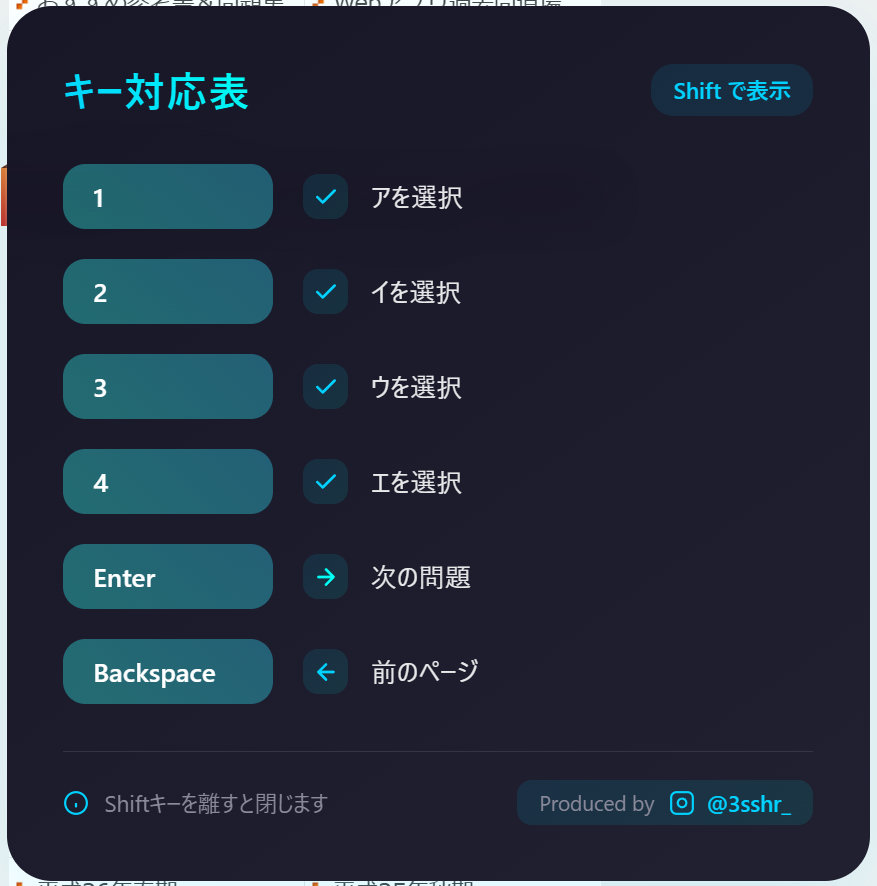

# 🎯 **ExamDojoHelper**  

**「基本情報技術者試験や応用情報技術者試験の『過去問道場』での学習を効率化するキーボードショートカットスクリプト」**  
直感的かつスムーズに学習を進めましょう。

---

## 🚀 **主な機能**
✅ **キーボードショートカット**  
学習を効率化する直感的な操作が可能！以下のキーを押すだけで、マウス不要で学習を進められます。  
| キー       | 動作                                                                 |
|------------|----------------------------------------------------------------------|
| `1`        | 選択肢「ア」を選択                                                  |
| `2`        | 選択肢「イ」を選択                                                  |
| `3`        | 選択肢「ウ」を選択                                                  |
| `4`        | 選択肢「エ」を選択                                                  |
| `Enter`    | 次の問題に進む                                                      |
| `Backspace`| 前のページに戻る                                                    |
| `Shift`    | キー対応表を表示                                                    |
| `Shift` + `k`| 対応するキーを変更                                                    |

✅ **視覚的な補助機能**  
- `Shift`キーを押すと画面右下に操作ガイドを表示します。  
- 各キーがどの機能を担当しているのか、リアルタイムでわかります。  

✅ **スタイリッシュなUI**  
- **モダンなデザイン**：画面右下に角丸で横長のオーバーレイ表示。  
- 学習を邪魔せず、視覚的にスマートなレイアウトを実現。

---

## 🛠️ **セットアップ**

**ExamDojoHelper** を利用するには以下の手順を実施してください：

---

### 1️⃣ **拡張機能のインストール**

Google Chrome で以下のリンクをクリックし、拡張機能「User JavaScript and CSS」をインストールします：\
➡️ [User JavaScript and CSS をインストールする](https://chromewebstore.google.com/detail/user-javascript-and-css/nbhcbdghjpllgmfilhnhkllmkecfmpld?hl=ja)

---

### 2️⃣ **設定の追加**

拡張機能を有効化した後、以下の設定を行います：

1. Chrome の右上に表示される拡張機能アイコンをクリックします。
2. **「User JavaScript and CSS」** を選択して、設定画面を開きます。
3. **「New」ボタン** をクリックして、新しいスクリプトを追加します。

---

### 3️⃣ **URL パターンを設定**

以下の URL パターンを登録してください：
`https://www.fe-siken.com/*,https://www.ap-siken.com/*`

---

### 4️⃣ **スクリプトを入力**

設定画面の **「Start typing JavaScript here」** 欄に、プロジェクトの [`script.js`](https://github.com/s27x4/ExamDojoHelper/blob/main/script.js) ファイルの内容をコピー＆ペーストします。

---

### 5️⃣ **追加のオプションを有効化**

以下の設定を有効にします：

- **「Isolated environment」** を **オン** にする\
  （スクリプトが他のページ要素に影響を与えないようにします）
- **「Run at the start」** を **オン** にする\
  （ページ読み込み時にスクリプトがすぐに実行されるようにします）

---

### 6️⃣ **設定を保存**

すべて入力したら、設定を保存して準備完了です！\
「過去問道場」にアクセスして、キーボードショートカットや視覚補助機能をお試しください。

---

これで **ExamDojoHelper** のセットアップは完了です！ 🎉

---

## 🎨 **スクリーンショット**

| 視覚補助表示 (`Shift`キー押下中)    |
|------------------------------------|
|  |

---

## 💡 **アイデアと貢献**

🎉 **アイデア大歓迎！**  
- このツールをより良くするための提案、バグ報告を歓迎します。  
- Issue や Pull Request を通じて、ぜひコントリビューションしてください！

---

## 📜 **ライセンス**
このプロジェクトは [MIT License](LICENSE) のもとで公開されています。

---

## 🌟 **最後に**
**ExamDojoHelper** は、試験勉強の効率化をサポートし、あなたの合格を応援します！ 🎉  
ぜひこのツールを活用して、目標達成を目指してください！

  
